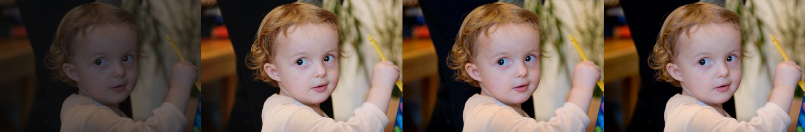
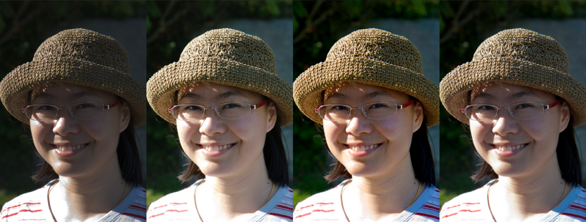
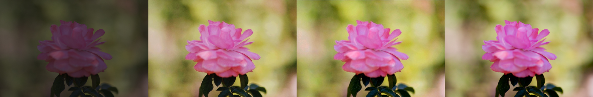
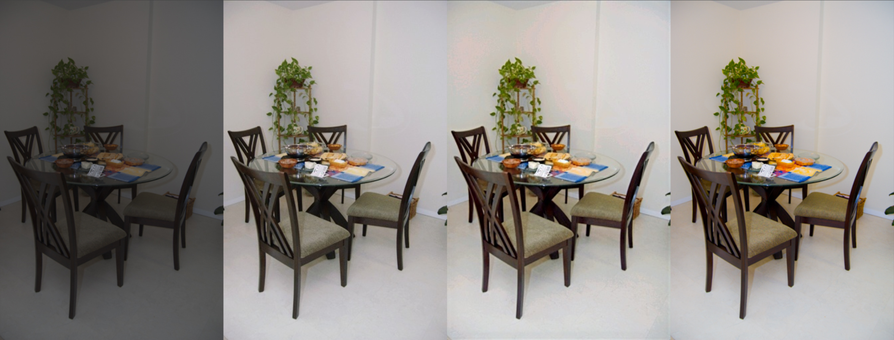
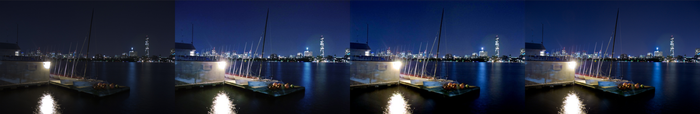
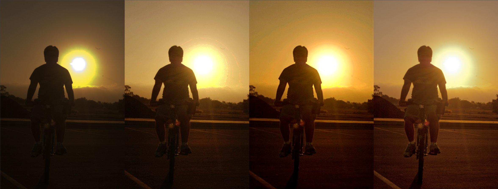
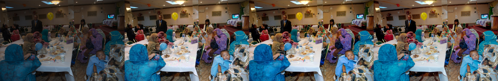
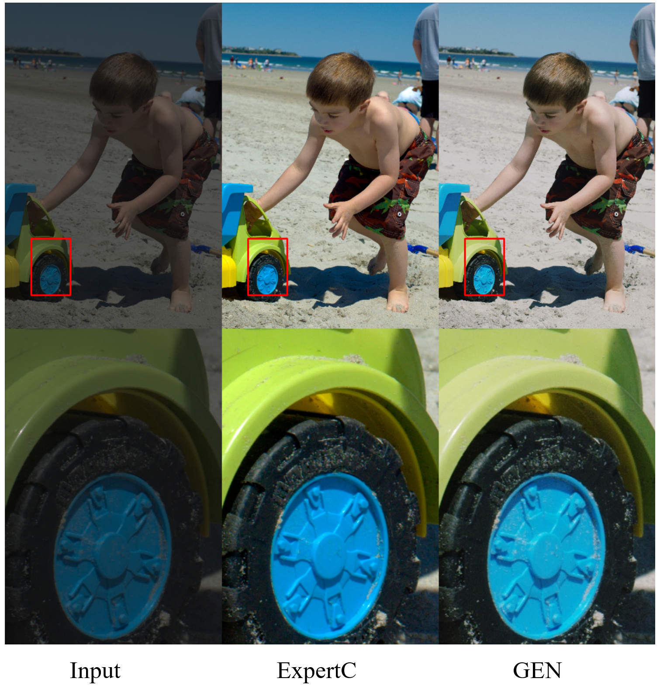

# GLeNet_TF2.3

A complete inplementation of paper **《GLeNet-Global and Local Enhancement Networks for Paired and Unpaired Image Enhancement》**（2020 ECCV）


This repo is based on official code [GleNet](https://github.com/dongkwonjin/GleNet)，which is incomplete and brings trouble to me. So I rewrite the code for paird training.

官方代码比较简单，只有模型和数据，模型还不完整。***我在官方代码的基础上，写了下训练的代码，目前只有 paired 训练***，后面有时间再补充 Unpaired 训练的代码和模型。

目前写了 GEN 全局增强网络部分；后面的 LEN 局部增强网络就一个 Unet 也没啥创新。其实，之前复现实验发现局部增强网络 LEN 就可以达到 25 的效果了，GEN + LEN 也就高个 0.3db 左右。估计就是全局网络求解一个近似值，然后 Unet 补一补。如果最后可以加一些平滑损失什么的，可能可以减少块效应。

损失函数 ，没啥好说的，论文用的 MAE 和一个感知损失，我直接用 MSE，至于感知损失？imagenet 训练的图片都相对单调，用在 fivek 这种相对复杂场景下不合适。结果**过拟合了**，也达不到论文里的那么高的指标，可能是我训练方法、数据处理不太对的缘故吧，不过至少，原理上是对的，刷榜什么的本人不会。目前的指标$PSNR; SSIM$ 如下

| MIT-Adobe FiveK  512px(4500 : 500) |        train        |        valid        |
| :--------------------------------: | :-----------------: | :-----------------: |
|             paper-GEN              |        None         |   25.47 db; 0.917   |
|          paper-GEN + LEN           |        None         |   25.88 db; 0.925   |
|                GEN                 |   24.59 db; 0.885   |   23.94 db; 0.862   |
|             GEN + LEN              | **25.15** db; 0.904 | **24.54** db; 0.887 |

近期事多，暂且搁置这个 repo，后面有时间再更新吧


## 环境

- Python3.7
- Tensorflow 2.3.0
- scikit-image 0.15.0
- ...

```shell
pip install requirements.txt
```


## Inference

```shell
python inference.py
```

主要的参数如下，直接在 `inference.py` 中修改

```python
# 是否使用 GPU
opt.use_cuda = True
# 是否采用 LEN 局部增强网络
opt.use_local = False
# 输入图片的文件夹
opt.images_dir = "./sample_imgs"
# 增强结果保存的文件夹
opt.results_dir = "./sample_results_GEN"
# 训练好的模型文件夹路径 + GleNet
opt.checkpoints_file = './checkpoints/LEN_False_batch_4/epoch_71_train_24.595_0.885_valid_23.945_0.862/GleNet'
# ......
```

**说明：** 如果用到了 LEN 局部增强网络，里边有 Unet，所以输入的图片大小必须是 8 的倍数，如果不是 8 的倍数，会自动裁剪成 8 的倍数，这个要注意。

## Samples

从左到右分别是： 原图，GEN，GEN + LEN，标签（label）

人物 People





物 Object



室内 Indoors



室外 Outdoors


夜景 Night



背光  Backlit



复杂场景  Complex



观察上面的图象，效果还行，GEN 生成的图像在边缘上有光晕现象，GEN+LEN生成的图像存在块状效应，尽管 GEN+LEN 的指标更高，但不能应用到手机上。

**细节  Details**

从左到右分别是：原图，GEN，标签（label）

因为 LEN 处理高清分辨率图像，显存爆了。。。



观察区域细节，纹理保持完整，不存在明显的模糊现象，但存在明显的色差问题，这是 1D-LUT 原理上就存在的问题，全局映射。


## Data

使用的是 [MIT-Adobe FiveK](https://data.csail.mit.edu/graphics/fivek/) 数据集的 **ExpertC** 图像对。本实验采用的 512px 分辨率（长宽最大 512，按比例下采样）的图像，下载链接如下：

1. [one drive](https://bupteducn-my.sharepoint.com/:u:/g/personal/fluence_dyf_bupt_edu_cn/EbbaJoJVSG9Guh5TWMLCXw8B0DkHPMwCGZ9QQeUtm6pwSA?e=FovmfI)

也可以使用其他数据集，低光照的数据集，比如 LOL 等。


## Train

```shell
python train.py
```

or

```shell
python weighted_train.py
```

具体参数应该都能看得懂，直接修改即可。


## Validation

```shell
python test.py
```

验证 fiveK 上的增强效果；

具体参数修改参考之前的  Inference。


## References

**papers**:

1. Kim, Hanul et al. “*Global and Local Enhancement Networks for Paired and Unpaired Image Enhancement*.” *ECCV* (2020).
2. Bychkovsky V, Paris S, Chan E, et al. *Learning photographic global tonal adjustment with a database of input/output image pairs*[C]//CVPR 2011. IEEE, 2011: 97-104.

**github**:

1. [GLeNet](https://github.com/dongkwonjin/GleNet)

**Dataset**

```txt
@inproceedings{fivek,
	author = "Vladimir Bychkovsky and Sylvain Paris and Eric Chan and Fr{\'e}do Durand",
	title = "Learning Photographic Global Tonal Adjustment with a Database of Input / Output Image Pairs",
	booktitle = "The Twenty-Fourth IEEE Conference on Computer Vision and Pattern Recognition",
	year = "2011"
}
```

