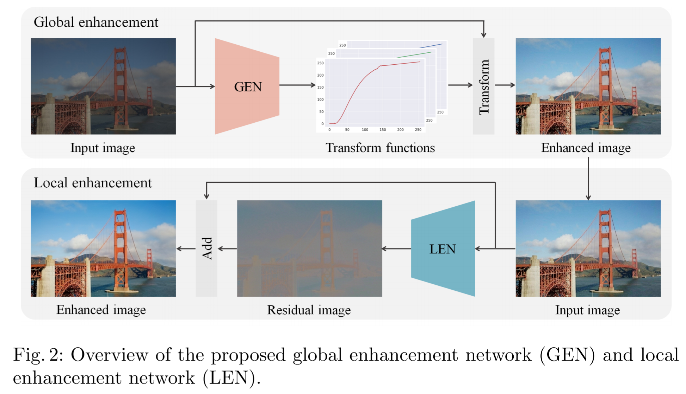

# GLeNet_TF2.3

A complete inplementation of paper **《GLeNet-Global and Local Enhancement Networks for Paired and Unpaired Image Enhancement》**（2020 ECCV）

This repo is based on official code [GleNet](https://github.com/dongkwonjin/GleNet)，which is incomplete and brings trouble to me. So I rewrite the code for paird training.

官方代码比较简单，只有模型和数据，模型还不完整。我在官方代码的基础上，写了下训练的代码，目前只有 paired 训练，后面有时间再补充 Unpaired 训练的代码和模型。

## 环境

## Inference

## Train

## Validation

## References

**papers**:

1. Kim, Hanul et al. “Global and Local Enhancement Networks for Paired and Unpaired Image Enhancement.” *ECCV* (2020).

**github**:

1. [GLeNet](https://github.com/dongkwonjin/GleNet)

